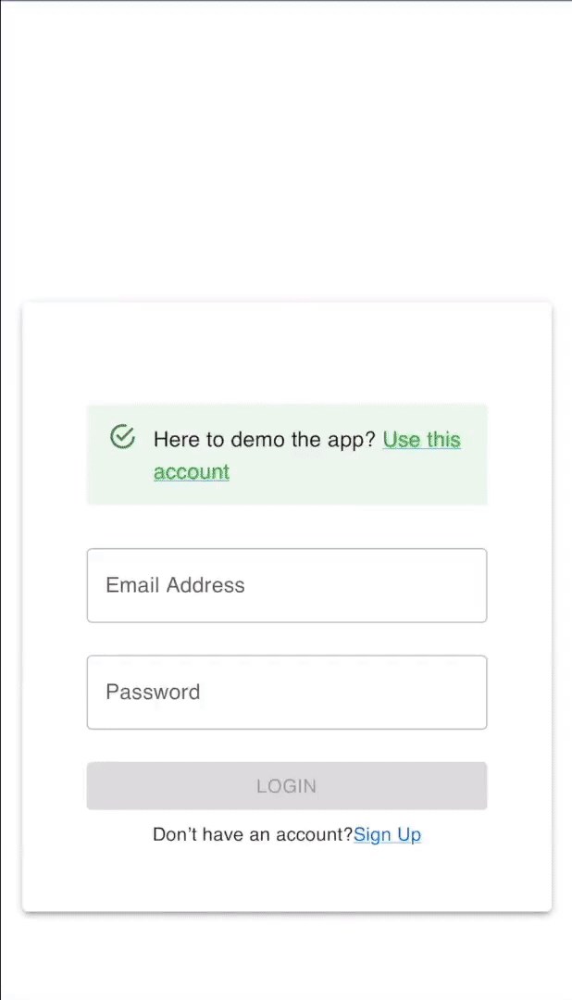

# ThriveVibe 🎥✨ (Fullstack Peer Feedback & Video Sharing App)

**Project's Backend:** https://github.com/FiorenNathasia/thrivevibe-backend

### 💻 Desktop View

### 📱 Mobile View

---

## 🧠 Overview

**ThriveVibe** is a platform designed to help early-stage content creators gather targeted feedback on their videos. By submitting videos with specific prompts, creators receive structured feedback through votes and comments, all visualized in a centralized dashboard to improve their content efficiently.

---

## 🔍 How is it done?

- Creators upload videos alongside tailored feedback prompts

- Reviewers engage with videos via a smooth, swipe based interface (modeled after Tinder) to easily submit votes on targeted prompts.

- Votes and optional comments are shown in a centralized dashboard for creators

- Responsive design ensures smooth experience on both mobile and desktop devices

---

## 🚀 Features

-🤝 **Peer Connections** Network with other content creators to share and receive feedback.
-🔄 **Swipe Interface** Effortlessly swipe through videos to vote and leave comments.
-📊 **Personal Dashboard** View feedback results and comments related to your uploaded videos in one place.

---

## 🛠️ Tech Stack

- **Frontend:** React (with responsive design)
- **Backend:** Express.js
- **Database:** PostgreSQL
- **Authentication:** JWT (OAuth)

---
